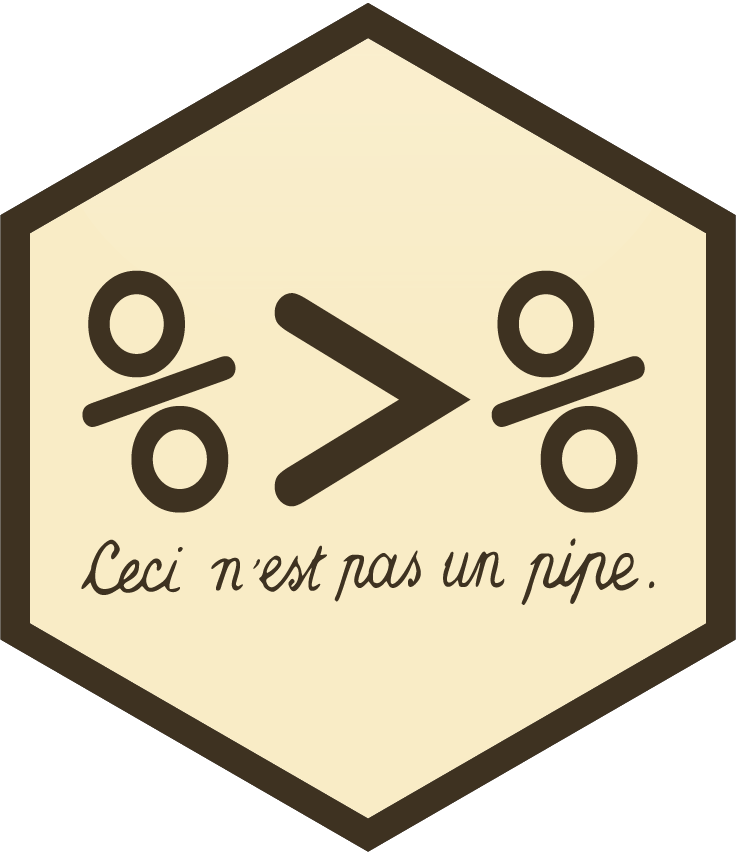

class: inverse, center, middle


# ¿Qué vamos a ver hoy?

### Funciones útiles 
### Funciones Principales

---


## Repo del curso
https://github.com/PatriLoto/AprendeR-desde-cero

## Repo de la charla
https://github.com/data-datum/dplyr-manipulation 

### Vignette de dplyr

https://cran.r-project.org/web/packages/dplyr/vignettes/dplyr.html


---


# Flujo de trabajo para Ciencia de Datos


---


### Ciencia de datos


.footnote[[*]
_Hands on programming with R_ by Garret Grolemund]
---


# Dataset: gapminder
```{r eval=FALSE, tidy=FALSE}
install.packages("gapminder") #<<
install.packages("dplyr") #<<
```

Gapminder es un set de datos que contiene en total 6 columnas correspondientes a:
- country(país)
- continent (continente)
- year (año) desde 1952 a 2007
- lifeExp (esperanza de vida)
- pop (población total)
- gdpPercap (ingreso per Cápita)
y 1704 observaciones


---


## gapminder en el tiempo

```{r tidy=FALSE, warning=FALSE, message=FALSE, echo=FALSE}
library(ggplot2)
library(gganimate)
library(gapminder)
ggplot(gapminder, aes(gdpPercap, lifeExp, size = pop, colour = country)) +
  geom_point(alpha = 0.7) +
  scale_colour_manual(values = country_colors) +
  scale_size(range = c(2, 12)) +
  scale_x_log10() +
  facet_wrap(~continent) +
  theme(legend.position = 'none') +
  labs(title = 'Year: {frame_time}', x = 'GDP per capita', y = 'life expectancy') +
  transition_time(year)
```


---


## El código

```{r tidy=FALSE, warning=FALSE, message=FALSE, eval=FALSE}
library(gganimate)
ggplot(gapminder, aes(gdpPercap, lifeExp, size = pop, colour = country)) +
  geom_point(alpha = 0.7) +
  scale_colour_manual(values = country_colors) +
  scale_size(range = c(2, 12)) +
  scale_x_log10() +
  facet_wrap(~continent) +
  theme(legend.position = 'none') +
  labs(title = 'Year: {frame_time}', x = 'GDP per capita', y = 'life expectancy') +
  transition_time(year)
```


---


# data.frame vs. tibble
- data.frame es una estructura nativas de rbase y está disponible sin necesidad de instalar ningún paquete adicional. Es una estructura tabular organizada en filas y columnas. Se puede acceder a las columnas mediantes colnames() y los nombres de las filas, como rownames().
- tibble, sin embargo, es parte de tidyverse. También presenta una estructura tabular, en filas y columnas. Los tibbles eliminan los rownames por defecto, para tener mejor compatibilidad con bases de datos SQL.

- Ambas formas son intercambiables mediante los comandos

```{r message=FALSE, warning=FALSE, eval=FALSE}
rbase::as.data.frame()
tidyverse::as_tibble()
```


---

class: inverse, middle, center


# Funciones Útiles

---


# Funciones Útiles

#### Cargamos las librerías 
```{r message=FALSE, warning=FALSE}
library(dplyr) #<<
library(gapminder) #<<
```
--
## head()
```{r }
head(gapminder) 
```

---


#Funciones Útiles 

## tail()
```{r }
tail(gapminder)
```


---


#Funciones Útiles

## glimpse()
```{r }
glimpse(gapminder)
```


---


#Funciones Útiles

## slice()
```{r gapminder, warning=FALSE}
dplyr::slice(gapminder, 5L)
```


---


#Funciones Útiles

## str()

```{r }
str(gapminder)
```

---


#Funciones Útiles

## summary()

```{r }
summary(gapminder)
```

---
class: inverse, middle, center



# Operador pipe 
# %>%

---


# Operador pipe %>%
- El operador pipe nos permite concatenar funciones y objetos en R, de forma que el código tenga un aspecto más ordenado, siguiendo la filosofía de tidyverse. 

```{r warning=FALSE, message=FALSE}
library(magrittr)
gapminder %>%
  filter(country=="Argentina")%>%
  select(gdpPercap, year) %>%
  head(2)
```

```{r warning=FALSE, message=FALSE}
head(select(filter(gapminder, country=="Argentina"), gdpPercap, year), 2)
```


---
class: inverse, middle, center


# Funciones principales de dplyr 

---
class: middle, center

## select(): extraer columnas
## filter(): extraer filas siguiendo una restricción lógica
## mutate(): crea nuevas variables
## summarise(): cambiar la unidad de análisis
## arrange(): ordenar filas por variables
## group_by(): agrupar según un determinado criterio

---


# select()

- Podemos extraer columnas

```{r }
gapminder %>%
  select(country, lifeExp, gdpPercap)
```


---


# Funciones útiles para combinar con select()
```{r message=FALSE, warning=FALSE, echo=FALSE}
función <- c("-", ":", "contains()", "start_with()", "ends_with()", "everything()", "matches()", "num_range()")
descripción <- c("selecciona todas menos", "selecciona un rango", "selecciona variables cuyo nombre contiene...", "selecciona variables cuyo nombre empieza con ...", "selecciona variables cuyo nombre empieza con...", "selecciona todas las columnas", "selecciona variables cuyo nombre coincide con...", "selecciona variables por posición")
library(magrittr)
tableX <- cbind(función, descripción)
tableX %>%
  knitr::kable(format="html")
```


---


# Si tenemos que seleccionar las mismas columnas varias veces

```{r message=FALSE, warning=FALSE}
cols<-c("country", "lifeExp", "gdpPercap")

gapminder %>%
  select(!!cols)
```
---


# Podemos seleccionar según una expresión regular (regex)

```{r message=FALSE, warning=FALSE}
gapminder %>%
  select(matches("gdp"))%>%
  head
```


---


# filter()

- Realizamos el filtrado según un valor numérico de una variable. Para ello utilizamos los siguientes operadores: >, >=, <, =<, ==, !=

```{r }
gapminder %>%
  filter(lifeExp > 80) %>% #<<
  head(3)
```


---


# filter()

Podemos filtrar según múltiples condiciones:
- Se cumplen ambas condiciones 

```{r message=FALSE, warning=FALSE, eval=FALSE}
filter(condicion1, condicion2) #<<
```

- Se cumple la condición 1 solamente
```{r message=FALSE, warning=FALSE, eval=FALSE}
filter(condicion1, !condicion2) #<<
```

- Se cumplen la condición 1 y/ o la condición 2
```{r message=FALSE, warning=FALSE, eval=FALSE}
filter(condicion1 | condicion2) #<<
```

- Se cumple una u otra condición, pero no ambas (disyunción exclusiva)
```{r message=FALSE, warning=FALSE, eval=FALSE}
filter(xor(condicion1, condicion2)) #<<
```

---


# filter()

- Si queremos realizar un filtrado según un rango, lo hacemos de la siguiente manera

```{r message=FALSE, warning=FALSE}
gapminder %>%
  select (country, lifeExp, year) %>%
  filter(lifeExp >= 60, lifeExp < 85) %>% #<<
  head
```

---


# mutate()

- mutate() es una función que nos permite crear una nueva columna en un tibble, realizando una operación con otras ya existentes.

```{r }
gapminder %>%
  mutate(gdp = pop * gdpPercap) %>% #<<
  head
```


---


## Si queremos conservar sólo la nueva columna; usamos transmute()

```{r }
gapminder %>%
  transmute(gdp = pop * gdpPercap) %>% #<<
  head
```


---


# summarise()

```{r message=FALSE, warning=FALSE}
gdp_bycontinents <- gapminder %>%
    group_by(continent) %>%
    summarize(mean_gdpPercap=mean(gdpPercap)) #<<
gdp_bycontinents
```


---


#Funciones útiles para combinar con summarise():


.pull-left[
#### rbase
```{r message=FALSE, warning=FALSE, echo=FALSE}
funciones <- c("min(), max()", "mean()", "median()", "sum()", "var(), sd()")
descripción <- c("valores mínimos y máximos", "media", "mediana", "suma de los valores", "varianza y desviación típica")
table1 <- cbind(funciones, descripción)
table1 %>%
  knitr::kable(format="html")
```
]
.pull-right[
#### dplyr
```{r message=FALSE, warning=FALSE, echo=FALSE}
dplyr <- c("first()", "last()", "n()", "n_distinct()", "nth()")
descripción <- c("primer valor de un vector", "último valor de un vector", "el numero de valores en un vector", "número de valores distintos en un vector", "extraer el valor que ocupa la posición n en un vector")
table2 <- cbind(dplyr, descripción)
table2 %>%
  knitr::kable(format="html")
```
]


---


# arrange()

- Podemos reordenar los datos según otro criterio, por ejemplo, en vez ordenar por países, reordernarlos según año. 

```{r message=FALSE, warning=FALSE}
gapminder %>%
  arrange(year, country)
```


---


# arrange()

- Podemos reordenarlos de manera descendente

```{r message=FALSE, warning=FALSE}
gapminder %>%
  filter(year == 2007) %>%
  arrange(desc(lifeExp)) #<<
```

---


# Si quisiéramos encontrar los top 5 valores más altos o más bajos

```{r message=FALSE, warning=FALSE}
gapminder %>%
  top_n(5, lifeExp) %>% #<<
  head
```

---


# Si tenemos dudas 
### Podemos consultar la documentación

--

```{r message=FALSE, warning=FALSE, eval=FALSE}
?dplyr::select
?dplyr::filter
?dplyr::mutate
?dplyr::arrange
?dplyr::summarise
?dplyr::group_by
```
--


---
class: inverse, center, middle


# Muchas Gracias!!

---


```{r message=FALSE, warning=FALSE}
devtools::session_info()
```

---
